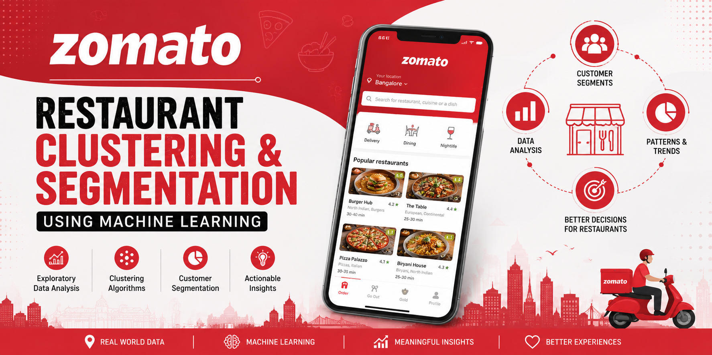
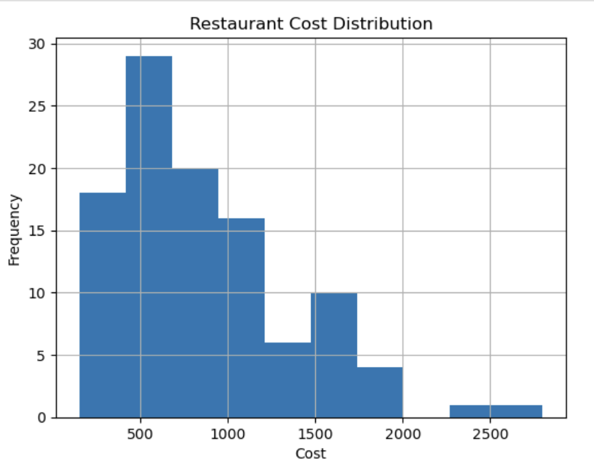
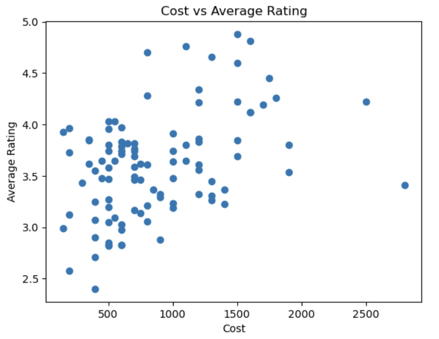
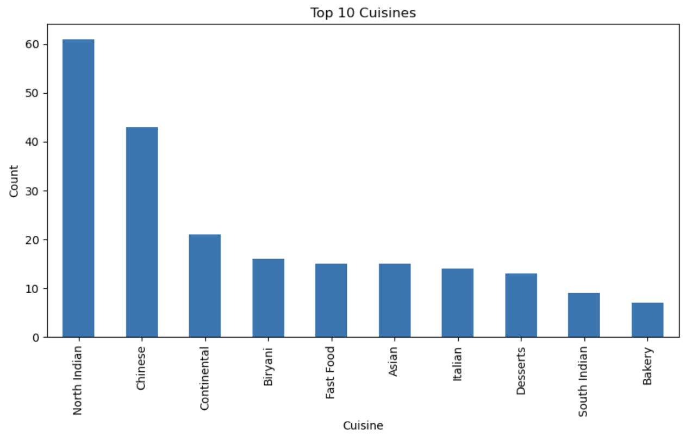
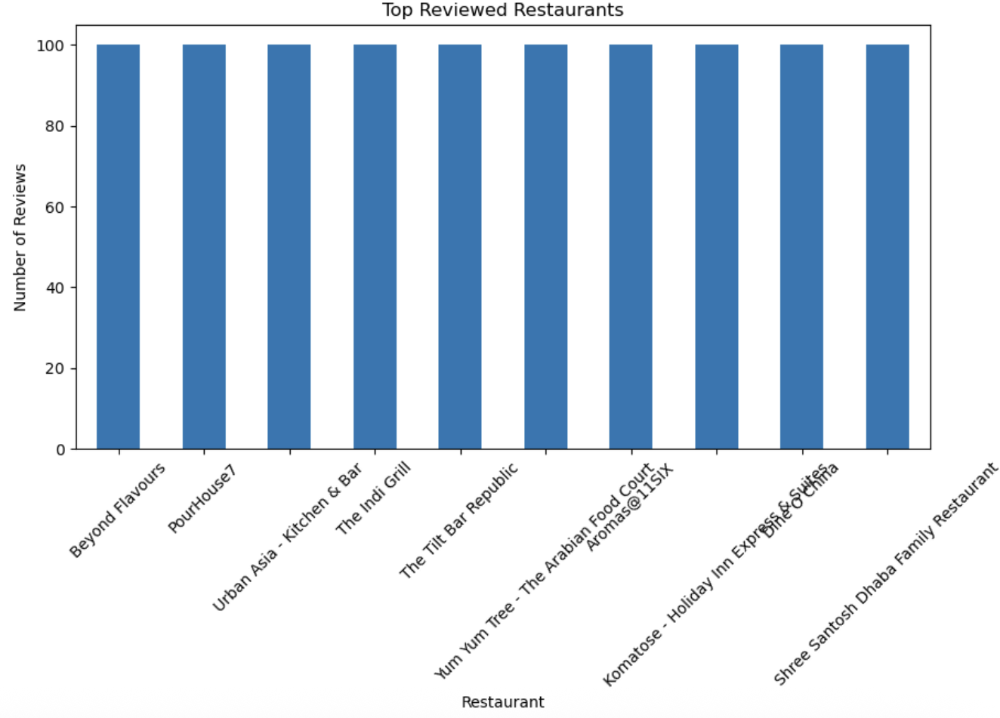
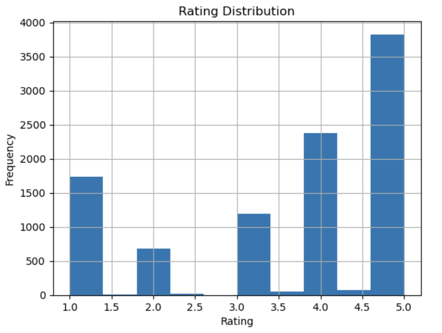

# 🍽️ Restaurant Clustering & Segmentation using Machine Learning

<p align="center">
  
</p>

## 📖 Project Overview

Restaurant businesses generate large amounts of operational and customer-related data every day. Understanding this data is essential for identifying customer preferences, pricing trends, and restaurant characteristics. However, manually analyzing thousands of restaurants can be challenging.

This project applies **Unsupervised Machine Learning** techniques to segment restaurants into meaningful clusters based on various attributes such as pricing, ratings, cuisines, and customer engagement. Three clustering algorithms—**K-Means**, **Agglomerative Clustering**, and **DBSCAN**—were implemented and compared to discover hidden patterns within the dataset.

The resulting clusters provide valuable business insights that can support pricing strategies, customer targeting, market expansion, and restaurant recommendation systems.

---

# ❓ Problem Statement

Restaurants differ significantly in terms of pricing, cuisines, ratings, and customer popularity. Businesses often struggle to identify groups of similar restaurants without predefined labels.

The objective of this project is to use clustering techniques to automatically segment restaurants into meaningful groups, allowing businesses to better understand the market and make data-driven decisions.

---

# 🎯 Objectives

- Clean and preprocess the restaurant dataset.
- Perform Exploratory Data Analysis (EDA).
- Identify important restaurant characteristics.
- Scale numerical features for clustering.
- Apply multiple clustering algorithms.
- Compare clustering models.
- Interpret restaurant segments.
- Generate meaningful business insights.

---

# 📂 Dataset Description

The project uses the **Zomato Restaurant Dataset**, which contains information about restaurants such as:

- Restaurant Name
- Location
- Average Cost for Two
- Online Order Availability
- Table Booking
- Restaurant Type
- Cuisines
- Average Rating
- Number of Votes

These features were used to analyze restaurant behavior and perform clustering.

---

# 🛠️ Technologies Used

- Python
- Pandas
- NumPy
- Matplotlib
- Scikit-Learn
- StandardScaler
- PCA
- K-Means Clustering
- Agglomerative Clustering
- DBSCAN

---

# ⚙️ Project Workflow

```text
Dataset
    │
    ▼
Data Cleaning
    │
    ▼
Exploratory Data Analysis
    │
    ▼
Feature Engineering
    │
    ▼
Feature Scaling
    │
    ▼
Clustering Algorithms
    │
    ├── K-Means
    ├── Agglomerative
    └── DBSCAN
    │
    ▼
Model Comparison
    │
    ▼
Business Insights
```

---

# 📊 Exploratory Data Analysis

Exploratory Data Analysis was performed to understand pricing patterns, customer ratings, cuisine popularity, and restaurant characteristics before applying clustering algorithms.

---

# 💰 1. Restaurant Cost Distribution

<p align="center">
  
</p>

### 📖 Observation

- The majority of restaurants have an average cost between **₹400 and ₹1000** for two people.
- Premium restaurants charging more than **₹2000** are comparatively fewer.
- The distribution is positively skewed, indicating that expensive restaurants are relatively uncommon.

### 💼 Business Insight

The restaurant market is primarily dominated by **budget and mid-range restaurants**. Businesses entering the market may benefit from focusing on affordable pricing strategies, as they cater to the largest customer segment.

---

# ⭐ 2. Average Cost vs Average Rating

<p align="center">
  
</p>

### 📖 Observation

- Restaurants with higher prices often receive good ratings.
- However, many affordable restaurants also achieve ratings above **4.0**.
- There is no strong linear relationship between pricing and customer ratings.

### 💼 Business Insight

Higher pricing alone does not guarantee better customer satisfaction. Restaurants should prioritize food quality, service, and overall customer experience rather than relying solely on premium pricing.

---

# 🍜 3. Most Popular Cuisines

<p align="center">
  
</p>

### 📖 Observation

- **North Indian cuisine** is the most common cuisine in the dataset.
- Chinese cuisine ranks second in popularity.
- Biryani, Continental, Fast Food, Asian, and Italian cuisines also have a significant presence.

### 💼 Business Insight

North Indian and Chinese cuisines dominate the restaurant market, indicating strong customer demand. Less common cuisines may provide opportunities for niche restaurants to differentiate themselves.

---

# 🍽️ 4. Most Reviewed Restaurants

<p align="center">
  
</p>

### 📖 Observation

The selected restaurants exhibit similar review counts in the current visualization, indicating consistent customer engagement among these entries.

> **Note:** If this graph was generated without sorting by review count, it is recommended to regenerate it using the highest review counts for a more accurate representation.

### 💼 Business Insight

Restaurants with higher customer engagement generally have stronger brand visibility and can leverage positive customer interactions to attract more visitors.

---

# ⭐ 5. Rating Distribution

<p align="center">
  
</p>

### 📖 Observation

- Most restaurants have ratings between **4.0 and 5.0**.
- Very few restaurants have ratings below **3.0**.
- The dataset is heavily concentrated around higher customer ratings.

### 💼 Business Insight

Since most restaurants maintain high ratings, additional factors such as pricing, cuisine, and customer engagement become important for differentiating restaurant segments.

---

# 🧹 Data Preprocessing

Before applying clustering algorithms, the dataset was cleaned and transformed to improve data quality and ensure meaningful clustering results.

The preprocessing steps included:

- Removed duplicate records.
- Handled missing values.
- Selected relevant numerical features for clustering.
- Renamed columns for better readability.
- Checked data types and converted them where necessary.
- Removed unnecessary columns that did not contribute to clustering.

Proper preprocessing helps reduce noise and improves the overall quality of the clusters.

---

# ⚖️ Feature Scaling

Since clustering algorithms are distance-based, features with larger numerical values can dominate the clustering process.

To avoid this issue, **StandardScaler** was used to standardize the selected numerical features.

### Why Feature Scaling?

- Prevents features with larger values from dominating.
- Improves clustering accuracy.
- Ensures all features contribute equally.
- Produces more balanced clusters.

---

# 🤖 Clustering Algorithms

Three different clustering algorithms were implemented and compared to identify the most meaningful restaurant segments.

---

## 1️⃣ K-Means Clustering

K-Means is a partition-based clustering algorithm that divides data into **K** distinct clusters by minimizing the distance between data points and their cluster centroids.

### Why K-Means?

- Fast and computationally efficient
- Easy to interpret
- Suitable for large datasets
- Produces well-defined clusters

### Workflow

- Select the number of clusters.
- Initialize cluster centroids.
- Assign each restaurant to the nearest centroid.
- Update centroids.
- Repeat until convergence.

---

## 2️⃣ Agglomerative Clustering

Agglomerative Clustering is a hierarchical clustering technique that starts by treating every restaurant as an individual cluster and gradually merges similar clusters.

### Why Agglomerative Clustering?

- Captures hierarchical relationships
- Does not rely on random initialization
- Useful for understanding cluster structures

### Workflow

- Treat every restaurant as its own cluster.
- Calculate distances between clusters.
- Merge the closest clusters.
- Continue until the desired number of clusters is reached.

---

## 3️⃣ DBSCAN

DBSCAN (Density-Based Spatial Clustering of Applications with Noise) groups restaurants based on the density of data points instead of predefined cluster centers.

### Why DBSCAN?

- Detects outliers automatically
- Finds clusters of arbitrary shapes
- Does not require specifying the number of clusters

### Workflow

- Identify dense regions.
- Expand clusters from dense points.
- Mark sparse points as outliers.

---

# 📊 Model Comparison

To evaluate the effectiveness of the clustering techniques, three unsupervised learning algorithms were implemented and compared using the **Silhouette Score**, which measures how well each data point fits within its assigned cluster. A higher score indicates better-defined and more compact clusters.

| Algorithm | Silhouette Score | Performance |
|------------|:----------------:|-------------|
| **Agglomerative Clustering** | **0.3702** | 🥇 Best Cluster Separation |
| **DBSCAN** | **0.3562** | 🥈 Good Performance |
| **K-Means** | **0.3342** | 🥉 Good Performance |

### 📖 Interpretation

- **Agglomerative Clustering** achieved the highest Silhouette Score (**0.3702**), indicating the most compact and well-separated clusters.
- **DBSCAN** also performed well by identifying dense restaurant groups while effectively handling noisy data.
- **K-Means** produced meaningful clusters with slightly lower separation but remained computationally efficient and easy to interpret.

### 💼 Final Model Selection

Although **Agglomerative Clustering** achieved the highest Silhouette Score, **K-Means** was selected for final visualization and interpretation because of its simplicity, scalability, and clear cluster assignments. Its results are easier to explain and suitable for business-oriented restaurant segmentation.

---

# 🎯 Cluster Interpretation

The clustering process successfully grouped restaurants with similar characteristics into meaningful market segments.

The identified clusters generally represent:

- 💰 **Budget-Friendly Restaurants** – Affordable restaurants with lower average costs that cater to price-conscious customers.
- 🍽️ **Mid-Range Restaurants** – Restaurants offering balanced pricing and consistent customer ratings.
- ⭐ **Highly Rated Restaurants** – Restaurants recognized for excellent customer satisfaction and high ratings.
- 💎 **Premium Restaurants** – High-end restaurants targeting customers seeking premium dining experiences.
- 📈 **High-Engagement Restaurants** – Restaurants with strong customer interaction reflected through reviews and ratings.

These clusters provide valuable insights for restaurant owners, food delivery platforms, and business analysts by identifying different market segments and customer preferences.

---

# 💡 Key Business Insights

The exploratory analysis and clustering results revealed several important business insights:

- Most restaurants fall within the **budget and mid-range** pricing categories, indicating strong customer demand for affordable dining options.
- Higher pricing does **not** necessarily guarantee better customer ratings, highlighting the importance of food quality and service.
- **North Indian** and **Chinese** cuisines dominate the dataset, reflecting their widespread popularity among customers.
- Customer ratings are largely concentrated between **4.0 and 5.0**, suggesting generally positive dining experiences.
- Restaurant segmentation enables businesses to design targeted marketing campaigns for different customer groups.
- Identifying similar restaurant clusters helps businesses perform competitor analysis and develop effective pricing strategies.
- Combining pricing, ratings, cuisines, and customer engagement provides a more comprehensive understanding of restaurant performance than relying on a single factor.

---

# ✅ Conclusion

This project demonstrates how **Unsupervised Machine Learning** can be used to uncover meaningful patterns within restaurant data without requiring predefined labels.

After performing data preprocessing, exploratory data analysis, and feature scaling, three clustering algorithms—**K-Means**, **Agglomerative Clustering**, and **DBSCAN**—were implemented to segment restaurants based on pricing, ratings, cuisines, and customer engagement.

Among the evaluated models, **Agglomerative Clustering** achieved the highest Silhouette Score (**0.3702**), indicating the best cluster quality. However, **K-Means** was selected for final interpretation due to its simplicity, scalability, and easily interpretable cluster assignments.

The insights obtained from this project can support restaurant owners, food delivery platforms, and business analysts in making informed decisions related to pricing strategies, customer targeting, competitor analysis, and market expansion.

Overall, this project highlights the value of data-driven restaurant segmentation and demonstrates how clustering techniques can transform raw restaurant data into actionable business insights.

---

# 🚀 Future Scope

This project can be further enhanced by:

- Developing an interactive dashboard using **Power BI** or **Tableau**.
- Deploying the clustering model as a web application using **Flask** or **Streamlit**.
- Incorporating customer review sentiment analysis.
- Building a restaurant recommendation system.
- Applying advanced clustering techniques to improve segmentation.

---

# 📁 Project Structure

```text
zomato_segmentation/
│
├── README.md
│
└── zomato/
    ├── data/
    │   ├── Zomato_restaurant_data.xlsx
    │   └── Zomato_restaurant_reviews.xlsx
    │
    ├── images/
    │   ├── banner.png
    │   ├── cost_distribution.png
    │   ├── cost_vs_rating.png
    │   ├── cuisine_popularity.png
    │   ├── most_reviewed_restaurants.png
    │   └── rating_distribution.png
    │
    ├── models/
    │   ├── kmeans_model.pkl
    │   └── scaler.pkl
    │
    ├── notebook/
    │   └── zomato_segmentation.ipynb
    │
    ├── prediction.py
    └── requirements.txt
```

---

# 💻 Installation

Follow these steps to set up the project on your local machine.

### 1️⃣ Clone the Repository

```bash
git clone https://github.com/sidhi02/zomato_segmentation.git
```

### 2️⃣ Navigate to the Project Directory

```bash
cd zomato_segmentation
```

### 3️⃣ Navigate to the Project Folder

```bash
cd zomato
```

### 4️⃣ Install the Required Dependencies

```bash
pip install -r requirements.txt
```

### 5️⃣ Launch Jupyter Notebook

```bash
jupyter notebook notebook/zomato.ipynb
```

---

# ▶️ How to Run

1. Clone the repository.
2. Navigate to the **zomato** project folder.
3. Install the required Python libraries using `requirements.txt`.
4. Open **`notebook/zomato.ipynb`** in Jupyter Notebook.
5. Run the notebook sequentially to perform:
   - Data preprocessing
   - Exploratory Data Analysis (EDA)
   - Feature scaling
   - Restaurant clustering using K-Means, Agglomerative Clustering, and DBSCAN
   - Model evaluation and business insights

To run the prediction script:

```bash
python prediction.py
```

---

# ▶️ How to Run

1. Clone this repository.
2. Install the required dependencies.
3. Open `zomato_project.ipynb`.
4. Run the notebook sequentially.
5. Explore the visualizations, clustering results, and business insights.

---

# 📦 Requirements

- Python 3.x
- Pandas
- NumPy
- Matplotlib
- Scikit-learn
- Jupyter Notebook

Install all dependencies using:

```bash
pip install -r requirements.txt
```

---

# 🙌 Acknowledgements

- Zomato Restaurant Dataset
- Scikit-learn Documentation
- Pandas Documentation
- Matplotlib Documentation

---

# 👩‍💻 Author

**Sidhi**

Aspiring Data Analyst | Machine Learning Enthusiast

Feel free to connect with me or explore my other projects on GitHub!

GitHub: https://github.com/sidhi02

---

## ⭐ If you found this project useful, consider giving it a star on GitHub!
